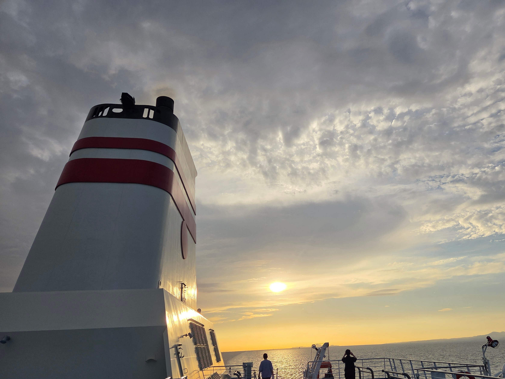
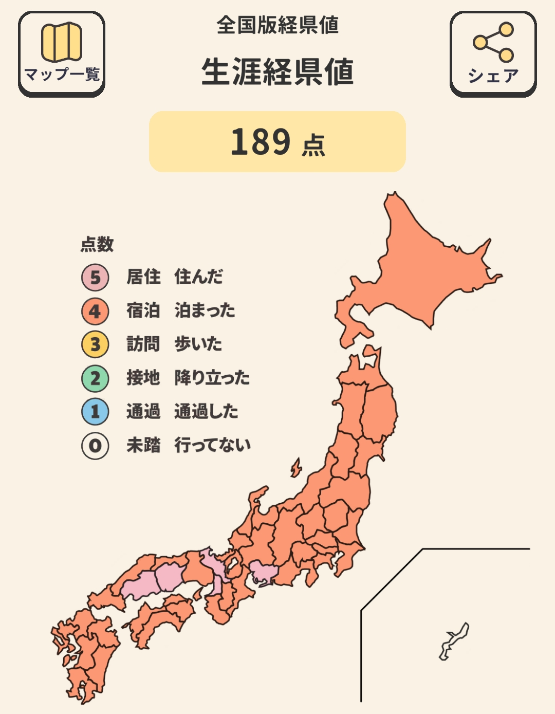
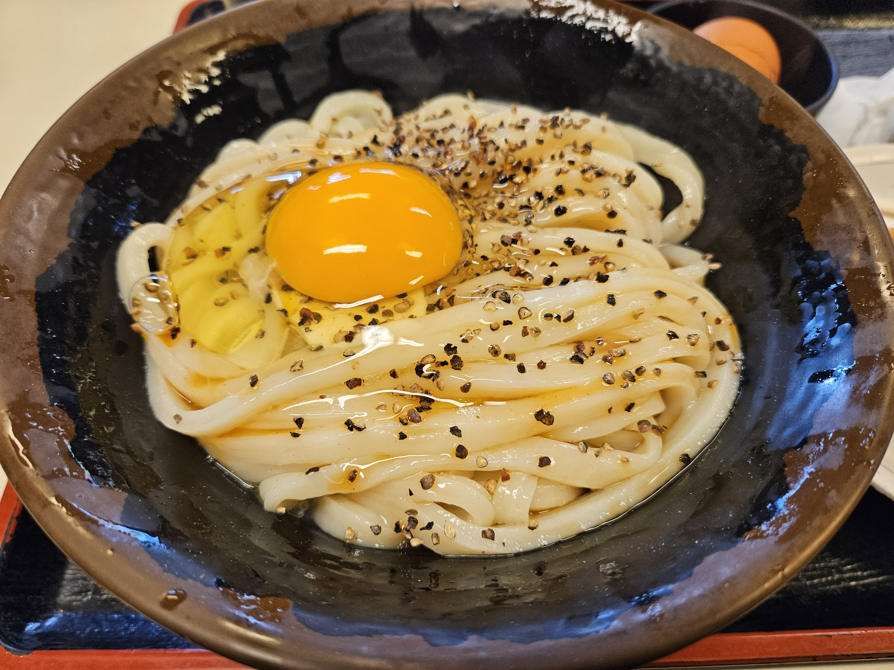
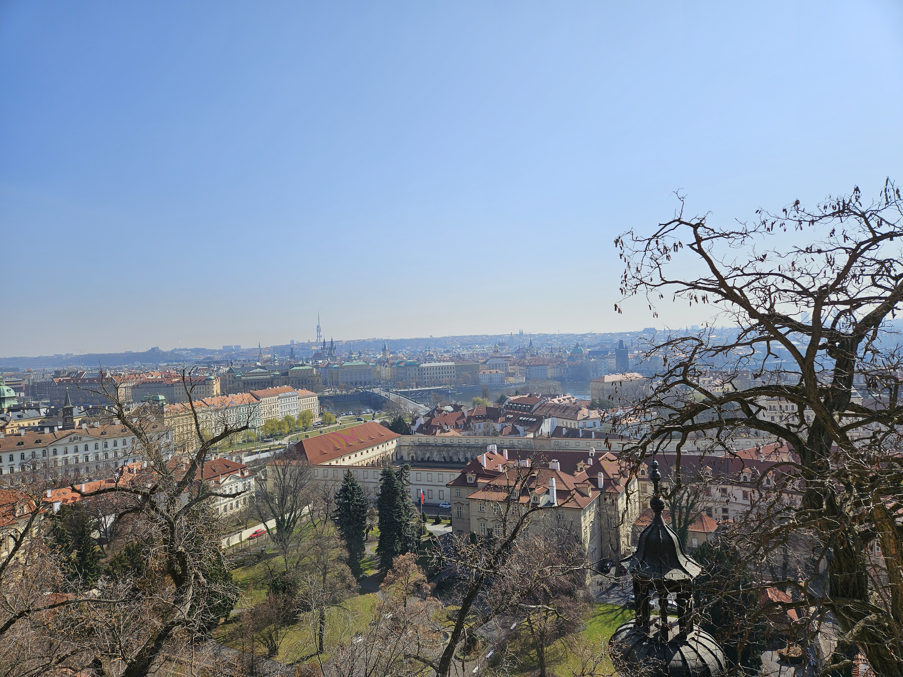
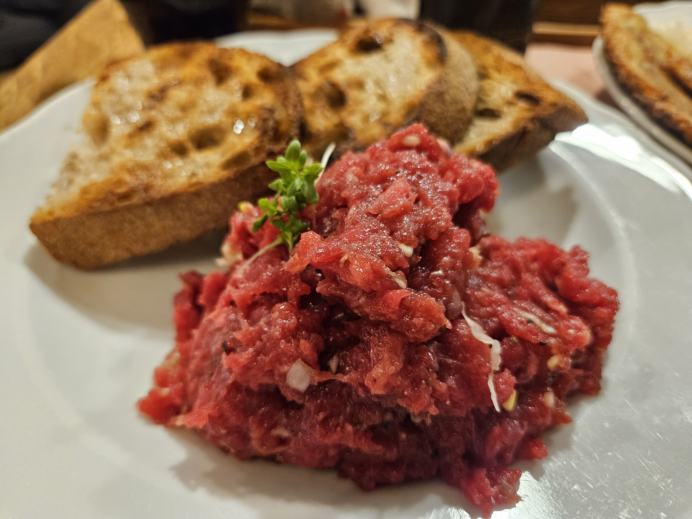
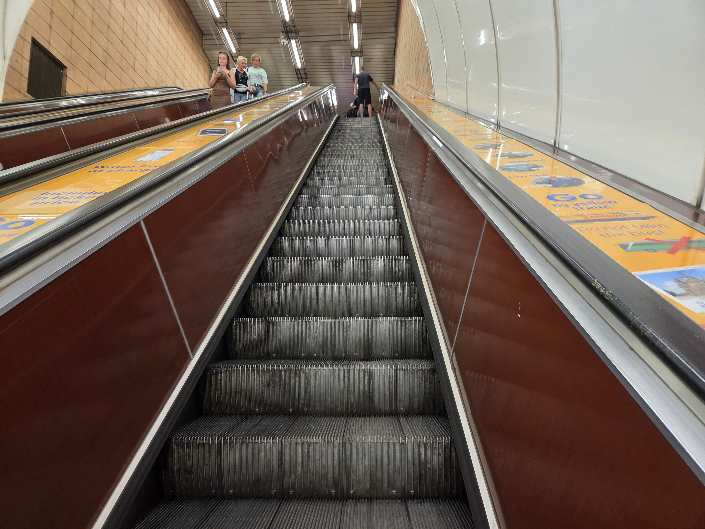
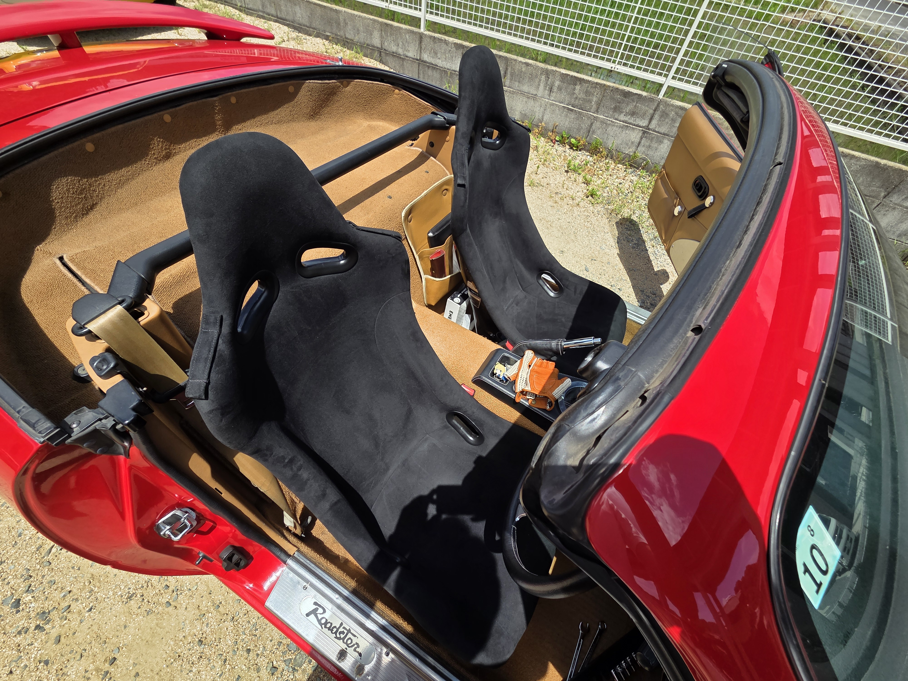

## 2025年も終わり

こんばんは。明日の朝が早いので大急ぎでこれを書いています。
そしてさらっとブログをフルリニューアルしています。そのことはまた別記事で書きます。

早いもので2025年が終わり、2026年がやってくるそうなので、振り返っていきます。

サムネイルはブダペスト市街地と「漁夫の砦」です。

## 妻が丸一年いなかった

なんと妻が丸一年いませんでした。チェコにワーホリに行っておりまして。
さすがに寂しくなってきたので早く帰ってきてほしいですが、なぜか妻がいないと「ものすごい規則正しい人間になる」ことがわかりました。

思いつくだけでも...

* 週3でジム
* 夜10時就寝
* 朝5時半に起床して朝ご飯、作業
* 自炊
* こまめな掃除

ちょっと前の自堕落な生活からは考えられない。別人になりました。
規則正しい生活って、たいへん楽ちんなんだ、ということがわかったのが今年の収穫でした。変な判断が必要なく、ルーティンをこなしていけばいいので。

妻が帰ってきてもできるだけルーティンを維持していくぞい。

## いろんなところに行った

妻がいなかったのもあり、いろんなところに足を運びました。
北は青森、南は鹿児島。すべて車とフェリーでの移動です。

今年の目標の1つだった「経県値の完全制覇」は、ほぼ達成。沖縄を残して居住・宿泊で埋めてやりました。

日本の主要都市をほぼ回ってみて改めて思うのは、近代日本は明治維新から始まっているということ。

鹿児島や高知といった新政府側の藩があった場所は、今でもきらびやかな感じがするし、逆に会津とか奥羽越列藩同盟の東北地方などは、街はあっても華やかさは正直感じられなかった。

地理的要因もあれど、やはり明治維新で要人を多く輩出することになった地域は、当時の繁栄がそのまま残ってるように思う。

ちなみに旅先で食べたご飯で一番おいしかったのは香川のうどんです。うますぎる。

バカ一代という有名なお店です。

<LinkCard url="http://www.udonbakaichidai.co.jp/" />

日本だけでなく、ヨーロッパにも2回行きました。まさか自分の人生、年に2回も欧州へ赴くことになるとは...（もちろん妻の様子見です）

欧州と言っても訪れたのは東欧よりの地域ばかり。

* プラハ（チェコ）
* クラクフ（ポーランド）
* シュトゥットガルト（ドイツ）
* ブダペスト（ハンガリー）
* ウィーン（オーストリア）

一番気に入ったのはプラハ。手の内に収まる街のサイズ感がちょっと京都に似てるなと。

ご飯も最初の3日くらいはおいしくいただけます。それ以降はだしが恋しくなります。これはタタラークという生牛肉のタルタル。

東欧は第二次世界大戦と共産主義の色がまだ色濃く残っています。こちらはソ連時代につくられたプラハのエスカレーター。

スピードがめちゃ速く、事故とか大丈夫なんかいなと聞いてみると、普通に事故があるみたいです。

東欧にはどの国に行ってもWW2や共産主義の資料館があります。だいたいどの資料館もWW2とソ連領時代を扱っていて、彼らにとってはその時代が地続きだとわかります。

しかしこの資料館、展示物が「生」すぎてあまり万人におすすめできず。自分は広島出身で原爆資料館を何度も訪れていますが、「生」度では東欧が上。

もし興味がありましたら、ブダペストの「恐怖の館」はおすすめです。

<LinkCard url="https://www.terrorhaza.hu/en" />

欧州の話は他にもいろいろあるのですが、また別記事で書ければと。

とにかくいろんな場所に行きまくったので、来年は近場を固める1年もアリかもですね。

## ぽこピーにドはまりした

みなさん知ってますかぽこピー。兄妹VTuberです。

<LinkCard url="https://www.youtube.com/channel/UC1EB8moGYdkoZQfWHjh7Ivw" />

めちゃくちゃおもしろいのでぜひ追いかけてください。

極楽湯コラボという裏口に近い特殊なルートで侵入してしまいましたが、今は毎日空いた時間で動画見てます。

11月に開催されたバーチャルライブにも行きましたし、来年の「回覧板」というリアルイベントにも行きます。
さらにピーナッツくん目当てでPUNPEEのワンマンにも行くことに...

趣味がつながっていく感じがしてよいですね。
妻がなぜかぽんぽこアンチなのもおもしろポイントです。

## ロードスターは今年も元気

愛車のロードスターは特に故障もなく、今年も元気に走ってくれました。
今年だけでだいたい2万キロ走ったみたいです。ヤバいですねw

30年以上前のクルマがこうして普通に走る。当たり前じゃねぇからな！？
忘れがちですが肝に命じておかないと、足を掬われるときが来ますので。

仕様変更はシートをエスケレートに入れ替えたくらいで大きいのはなし。
来年も引き続き順番待ちしているエンジンをのんびり待つ一年になりそうです。

みなさま引き続きよろしくお願いします。

## 転職した

もっと前のことのような気もしていますが、今年は転職をしました。前職には3年いたので3年ぶりの転職。

カスタマーエンジニアというエンジニアリングの知識もビジネススキルも必要な職種に、エンジニアの経験もビジネスサイドの経験もない人間が飛び込みましたが、職場のみなさまのおかげでなんとかやれています。

これでキャリアにおいてビジネス、開発、コーポレートの3大SaaS職種区分を制覇しましたが、意外？にもビジネスサイドが一番おもしろいです。
お客様と会話して、サービスの良さをわかってもらう。そのために苦心する。シンプルで奥が深いです。

来年は技術面も磨きつつ、お客様とのコミュニケーションの引き出しを増やしたいですね。

## よいお年を

というわけで、今年もたいへんお世話になりました。

振り返ると、過去数年で一番安定した年だったかな？という気がしています。
これまでの延長としての「発展」はいろいろありましたが、自分の中の「革命」はなかったような。

来年は小さなことでもいいから、自分の中に「革命」を起こせるといいかなぁ。

それではよいお年を〜。