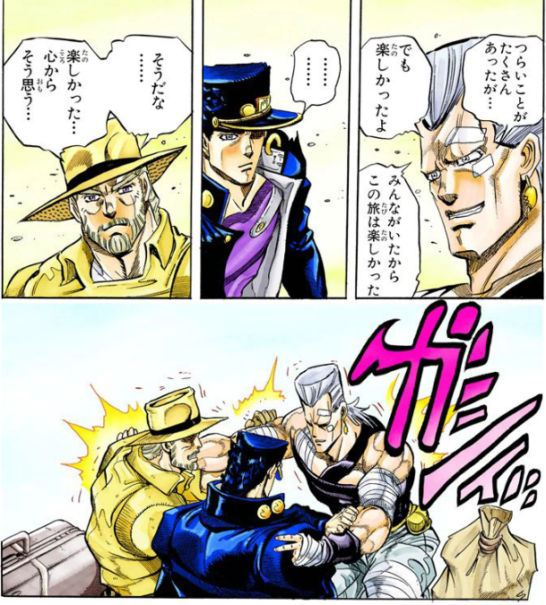
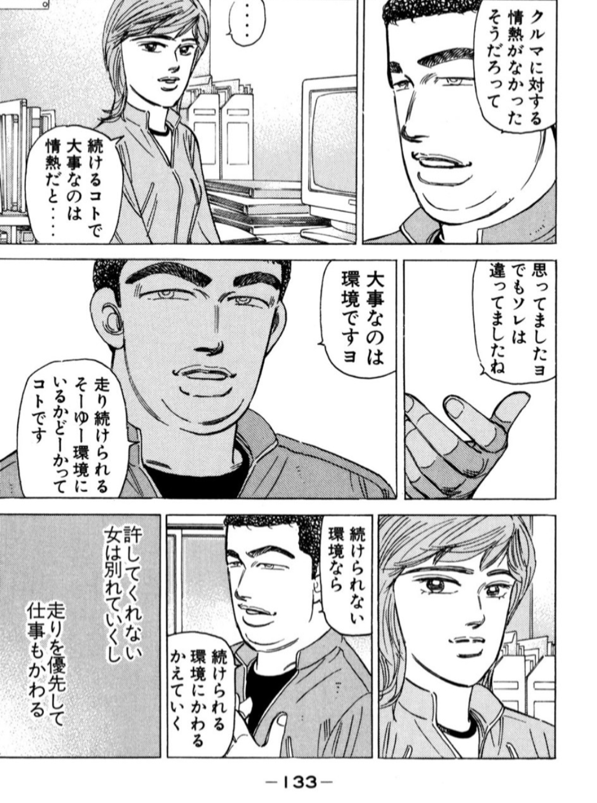

こんにちは。

なんと、30歳になってしまいました。

十年スパンで振り返る機会は人生でもそうないので、振り返りというか雑記というか、10年後の自分へのタイムカプセル代わりというか、そのような気分で書いています。

この数年は文章を書くことで口に糊してきたので、その締めくくりとしても。

## 「私」と「公」と「車」

この十年間は、大きく分けて私生活である「私」と、仕事である「公」と、そして自分にとって別格の領域である「車」というもので構成されてきました。
なので、振り返りもその構成で書いていこうと思います。

次の十年では新しい構成が追加されいるのか？楽しみですね。

## 「私」

この十年は、まさに妻と歩んできたといっても過言ではないです。19歳の頃から付き合っているわけなので。

京都一周トレイルを歩くのも、ひらパーに行くのも、SUPER GT観戦も一緒で、割と何をするにしても行動を共にしてきました。
撮った写真を遡っているんですが、本当よくこんな一緒に行動できるな、というくらい常に一緒にいてすごい。

大きな喧嘩は片手で収まるほどしかなく、最近は2人とも大人になったので平和な日々が続いています。

ここまで人生の初期の段階から、長く同じ相手と過ごしていると、人格形成にお互いが多少なりとも影響してきます。
依存とはまた違うし、パートナーという感じでもない。なにかを分け合っているような感覚。

得難い人を得たなと思います。

3年前に結婚もしました。結婚といえば人生の一大イベントですが、もう長い付き合いだったし、同居も長かったし、式も挙げなかったので、特におおごとではなかったですね。
自分は名字を変えましたが、それも特に大きな変化とは感じませんでした。ただ咄嗟のときはまだ旧姓で応えてしまうｗ

結婚して少し変わったことといえば、妻側の家族と縁が濃くなった感じはします。もともと演劇に連れて行ってもらったりとお世話にはなっていたんですが、より日常的なやりとりが増えましたね。

自分が妻側の名字に変えたことの影響は、けっこうあるかもしれません。
やはり世代によっては、同じ名字であるというのは、家族の一員として認めてもらう上で見過ごせないことなのかもしれない。

直近では、妻がチェコにワーホリに行き、一年間家を空ける（今も空けている）というおもしろイベントがありました。

周囲からはよく「一緒に行かないの？」とか「自分だったら離婚も考える」とか言われたりもしますが、長い人生、別々で過ごす期間があってもええんちゃうという感じ。
妻にはぜひ、今しかできないことをやっていただければと思うし、自分もそうしたいと思っている。一人暮らしも意外と平気です。

ここまでは妻の話でしたが、大学時代も自分にとっては重要な時期でした。京都送った学生生活は、大切な宝物です。
鴨川を流れる水のようにゆっくりとした時の流れの中で、[「四角」のこころ](https://ja.wikipedia.org/wiki/%E8%A8%80%E8%91%89%E3%81%AF%E3%81%95%E3%82%93%E3%81%8B%E3%81%8F_%E3%81%93%E3%81%93%E3%82%8D%E3%81%AF%E5%9B%9B%E8%A7%92)がまるく削り磨かれていくこの感覚は、京都でしか得られないものだったかなと。

就職を機に名古屋、大阪と住む場所を変えましたが、やはり京都が落ち着きます。マンションも買っちゃったし、何事もなければ京都で暮らし続けたいですね。

これに関しては厳しい家計から何とか大学に行かせてくれた両親と、マンツーマンで勉強を教えてくれた先生たち、そして運に感謝するほかないです。
現実的な話ですが、身に余る大層な学歴も、その後の選択肢の幅を広げてくれているのは間違いないので、大学にも感謝しています。お金持ちになったら寄付したいね。

この十年で、自分は「妻」と「京都」という、2つの大切なものを得られたと思います。
振り返ると、楽しかった十年でした。もちろんつらいこともありはしましたが、妻と京都がいたから楽しかった、と言えるかもしれません。

ちなみに、妻と長距離のドライブに出かけた際は、家に到着する直前で、必ずジョジョ3部ED『Last Train Home』を聴くようにしています。
旅路感が出るのでおすすめです。

## 「公」

仕事に関してはうわっ...私の転職回数、多すぎ...？と言うのが第一印象です。なんとその数4回！
新卒のころはこんなに転職するなんて思ってもいませんでした。

ただ幸運だったのは、「辞めたい」よりも「つぎこれやりたい」の気持ちで転職できたということ。
なので、いわゆる典型的な転職活動というものをしたことがなく、「つぎこれやりたい」と思った1社のみにエントリーシートを出して、幸いなことにご縁をいただくというのを繰り返してきました。

「つぎこれやりたい」駆動なので、転職のたびにやることそのものも変わっている...
財務をやったり、ライターをやったりコード書いたり、今はセールスに関わってみたり。図らずしもビジネス・開発・コーポレートと、SaaS企業の3大職種区分をコンプリートしたことになります。

7年間仕事をやってみて思うのは、自分は仕事に対して純粋に「おもしろさ」を求めているな、ということ。

もちろん社会貢献だったり、「私」や「車」をよりよくするための具体的な報酬という側面も大事ですが、なにより重視しているのは「おもしろい」かどうかという点なのだという気づきを得ました。

内容にこだわりはなくて、とにかくおもしろければ満足するという。
責任感に欠けるなとも思いますが、20代の等身大の自分でもあったかな、と思います。

で、その「おもしろさ」について、職人的なスキル向上がまったく紐付いていない、というのがやや変わったところなのかもな、と思います。

ここまでの「公」の内容を見ればお分かりの通り、普通なら「こういう経験をして、こういう成長があった」という内容になるところですが、一切ない。
おそらくですが、「私」と「車」では「一つの道を極める」傾向があるので、「公」に反動が出ているような気がします。

いろいろな職務や環境で、まったく異なる方向の気づきや学びを得ることに興味を示してきたのが、20代までの仕事だったと思います。

何が価値として認められ、どんな行いが評価されるかは、所属する組織や職種、時代によって変わるもの。
AIの登場は、時代が変わる最たる例だと思います。彼らの登場は、価値があると認められる営みを一気に変えました。去年まで評価されていたものが、今年はまったく見向きもされないというシーンも見かけます。

そんな激しい変化の中、社会に対して自分をどこに置き、なにをなすかを考え、柔軟に自分を変えていくことが、自分にとっての仕事の「おもしろさ」なのかなと思います。
成長や自己実現というよりは、好奇心を満たす手段としての仕事。今の自分にとっては、この理解が仕事を表す上で一番しっくりきています。

ひとつ後悔があるとすれば、同僚ともっと長く働きたかったなということ。自分には過ぎた同僚に恵まれてきたなと思うので、まだまだ一緒に働けたらよかった、という思いはあります。
幸いなことに今も同じく過ぎた同僚に恵まれているので、30代はこれまでとは違っていきたいですね。

## 「車」

まだ言葉も話せない頃からスポーツカーのトミカを転がしていたくらいの人間なので、人生に占める車の割合というのはとても大きいです。

まずF1を海外で観戦できたこと。まさかモンツァを訪れることになるとは思ってもいませんでした。

現地に行く前は、ティフォシが持つのは野球のファンのようなタイプの熱狂なのかな〜と思っていたんですが、意外にもサッカーのワールドカップを観戦する若者のようなタイプが多かった印象でした。
イタリア人にとって、年一回のお祭りなんだな〜と。なのでフェラーリのキャップをかぶりつつマクラーレンのウェアを着ていたりと、めちゃくちゃな人もけっこういました。

あとは憧れていたアウトバーンを走れたのも思い出深いです。速度無制限は伊達じゃない！

実際は全区間が無制限というわけではなく、一部区間だけですが、無制限区間に入った途端に皆さん[アクセルを踏む踏む踏む〜！](https://youtu.be/qCe5gF_xJew?si=-BPzCQISK4BKRpqX&t=117)という感じでした。
120kmそこそこでチンタラ走ってたら事故ります。ドイツ車のメーターがなぜ260kmまで用意されているのか、身体で理解できました。

ポルシェ博物館とメルセデス博物館を訪れることができたのも最高でしたね。ドイツ車の偉大さをこれでもかと浴びることができました。

アウトバーンを走るなんて夢のまた夢と思っていましたが、少し調べて仕事を休めば、意外と簡単に実現できちゃいました。
自分が勝手にハードルを高くしているだけで、実は簡単なことなんて、山ほどあるということを教えてもらいましたね。

さて、ここまでは海外での楽しいお話でしたが、20代は、自分の車を手にしたことで、その世界が大きく広がった時期だったと振り返ります。

なんと言っても、働き始めてすぐフルローンでNAロードスターを買ったのは、京都で学生生活を送ったのと同じくらい人生に影響を及ぼしたと思います。
もうすぐ総走行距離が20万kmを超えようかというところですが、まだまだ元気に走っています。

買ってから10万kmくらい走っているので、だいたい地球を2周半ですかね。
北は仙台、南は鹿児島と、とにかく走りまくりました。そのへんを走るだけで楽しい車なので、色んな場所に足を伸ばしてくれたのも、豊かな20代を支えてくれました。

買ったのがロードスターでよかったです。今年で8年目ですが、未だに飽きを知りません。ロードスターが持つ楽しさの、ほんの1割くらいしか味わえていないのではないか、と思うほどです。
致命的な故障がなければ、おそらく一生乗るかなと思います。宝くじが当たったらポルシェは増車するけど！

維持の面でも、意外とお金がかからなくて、部品もまだまだ入手しやすい。そして、お金をかけようと思えばいくらでもかけられる。こういう車を初手で買えたのは行幸でした。
環境にも恵まれました。いいショップさんに出会えて、いろいろ教えてもらって、車をよくしてもらいました。

ただ車というのは楽しいことばかりではないです。奥が深すぎるがゆえに、何も考えないと何もわからず、お金だけ費やして終わっていく感じがあります。
そうした焦燥や不安を忘れず向き合い続けることが大事かな、というのが車を通じて学んだことです。

## 30代に思うこと

まず公私に限らず確実にやらなければと思うのは「おじさんの自認を持つこと」です。もう多少は持っているんですが、さらに強く持つ必要があります。

身体を鍛えて健康に保ち、今までより身だしなみに気を遣い、人との接し方に気を遣う。
今まで若さで乗り切っていた部分を、しっかりとコストをかけて補っていく。

強く意識していきたいです。

「私」に関しては、20代のように自由を謳歌できる年代ではないだろうという覚悟はあります。子どもとか親の介護とか、そういう話がいよいよ自分ごとになってきます。

特に親の介護。自分の両親と妻の両親は親子ぐらい歳が離れており、妻側の両親がそろそろそういう年齢になっています。介護のタイミングが両家で重ならないのはラッキーですね。

少なくとも向こう十年で、自分がどんどん自分だけのものではなくなっていくはずですが、ネガティブな気持ちはないです。
これまで作ってきた自分を分け与えるフェーズなのだなぁという感慨深さがありますし、何も自分だけが与えるわけじゃないですしね。
他者からもらったもので自分の人生がつくられていくことが楽しみです。

「公」に関しては、引き続きおもしろいお仕事をしていきたいですが、大きい方針として、財務やライター、エンジニアといった、企業においての内的な機関から、外部とのインターフェースへとシフトしていきたいと考えています。具体的にはカスタマーサクセスやプリセールスといったポジション。

「外部の人と話す」ことに、今までになくおもしろさを見いだしています。自分が人と話すことをこれほど気に入るとは正直思っていませんでした。20代と違って、叶うなら、今の仕事を続けていたいですね。

「車」に関しては、具体的ですがニュルブルクリンクを訪れるのが目標。
24時間耐久レースの観戦もしたいし、実際にコースを走ってもみたい。今の自分の目には難しい目標に映っていますが、やってみれば案外何とかなるんじゃないかと思っています。

そして、十年後もロードスターに乗れているとうれしいですね。
走り続けるのに必要なことは、情熱ではなく環境だと、あのACE後藤も言っていました。走り続けられる環境を、これからも整え続けたいです。

## おわりに

このブログを書いていて一番感じたことは「この十年のこと全然覚えてない」でした！
多分辛かったことをかなり忘れているので、全体として楽しげな十年というまとめになりました。

ただ無理に覚えておく必要もないとも思います。こうして振り返るときに、言葉として表現できたものが、自分にとって重要なものなのかもしれないですしね。

この文章をChatGPTに「ネガティブに評価して」とお願いすると、「まだ若すぎて人生の厳しさを理解していないのでは」と言われました。耳が痛い。

それでは30代も頑張っていくぞい！
