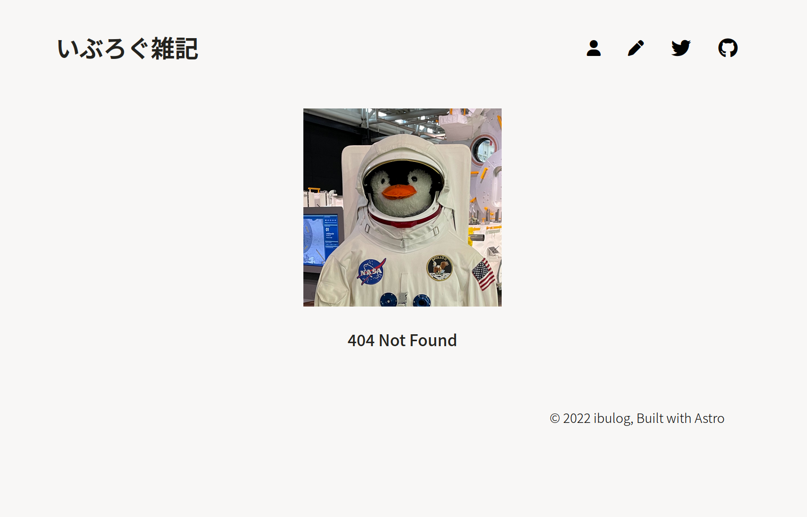

このブログはAstroを使ってビルドしています。ビルド早いし、コード読みやすいし、今のところ快適です。

ブログのコンテンツが増えてきて、一覧ページのスクロール量も増えてきたので、paginationしたい〜と思っていたところ、Astroでは簡単に実装できそうだったので、やってみました。

## ドキュメント

日本語翻訳されたドキュメントがあります。神...

https://docs.astro.build/ja/core-concepts/routing/#%E3%83%9A%E3%83%BC%E3%82%B8%E5%88%86%E5%89%B2

以下、ドキュメントのコードを引用しています。

```javascript
export async function getStaticPaths({ paginate }) {
  const astronautPages = [{
    astronaut: 'ニール・アームストロング',
  }, {
    astronaut: 'バズ・オルドリン',
  }, {
    astronaut: 'サリー・ライド',
  }, {
    astronaut: 'ジョン・グレン',
  }];
  // 宇宙飛行士の配列から、1ページに2人づつ入るようにページを生成する
  return paginate(astronautPages, { pageSize: 2 });
}
```

まず、動的ルーティングに必要な`getStaticPaths()`を使っています。Astroでは、`getStaticPaths()`内でルーティングのパラメータをreturnすると、動的ルーティングができます。

で、paginationを実装する場合は、`getStaticPaths()`内で、`paginate()`をreturnするらしい。`paginate()`の引数には、paginateしたいオブジェクトの配列と、1ページに含むオブジェクトの数を指定します。すると、`paginate()`がルーティングのパラメータを生成してくれます。

これで、`blog/1` といった具合に、勝手にページをルーティングしてくれるようです。

`paginate()`でpaginationすると、各ページのデータは`Astro.props`の`page`プロパティで渡されます。`page`プロパティのもろもろを使って、表示部分を実装すればよいわけですね。

```
interface Page<T = any> {
  /** 結果 */
  data: T[];
  /** メタデータ */
  /** 0から始まるページ上の最初のアイテムのカウント */
  start: number;
  /** 0から始まるページ上の最後のアイテムの数 */
  end: number;
  /** 結果の総数 */
  total: number;
  /** 1から始まる現在のページ番号 */
  currentPage: number;
  /** 1ページあたりのアイテム数（デフォルト：25） */
  size: number;
  /** 最終ページ数 */
  lastPage: number;
  url: {
    /** 現在のページのURL */
    current: string;
    /** 前のページのURL（もしあれば） */
    prev: string | undefined;
    /** 次のページのURL（もしあれば） */
    next: string | undefined;
  };
}
```

## コードを書く

前提として、`src/pages`配下のディレクトリ構成はこんな感じ。

```
.
├── blog
│   ├── 20191117-na-roadster-repair-power-window.md
│   ├── 20200608-kyoto-arashiyama.md
│   ├── 20200614-systemd-boot.md
│   ├── ...
│   └── index.astro
├── index.astro
└── rss.xml.js
```

`src/pages/blog`に、記事一覧を表示するAstroコンポーネントと記事のMarkdownファイルを置いています。

### Astroコンポーネントのファイル名を変更する

まずはpaginationしたいページのAstroコンポーネントの名称を `[page].astro`とします。これで、動的ルーティングができるようになります。

```
.
├── blog
│   ├── 20191117-na-roadster-repair-power-window.md
│   ├── 20200608-kyoto-arashiyama.md
│   ├── 20200614-systemd-boot.md
│   ├── ...
│   └── [page].astro
├── index.astro
└── rss.xml.js
```

### paginationを実装する

今回は10記事でページを分割します。`[page].astro`を編集していきます。

```javascript
export const postsPerPage = 10;
export async function getStaticPaths({ paginate }) {
  return paginate(allPosts, { pageSize: postsPerPage });
}
```

`getStaticPaths()`内で、`Astro.glob()`ですべての記事を取得します。

```javascript
export const postsPerPage = 10;
export async function getStaticPaths({ paginate }) {
  const allPosts = await Astro.glob('./*.{md,mdx}');
  return paginate(allPosts, { pageSize: postsPerPage });
}
```

このままだと、記事が古い順でpaginationされてしまうので、日付が新しい順にソートします。

```javascript
export const postsPerPage = 10;
export async function getStaticPaths({ paginate }) {
  const allPosts = await Astro.glob('./*.{md,mdx}');
  const allPostsSorted = allPosts.sort(
    (a, b) => new Date(b.frontmatter.pubDate).valueOf() - new Date(a.frontmatter.pubDate).valueOf()
  );
  return paginate(allPostsSorted, { pageSize: postsPerPage });
}
```

これで実装はおしまい。

`blog/1`、`blog/2`という感じで、各ページにアクセスできるようになりました！

### レストパラメーターを使う

paginationの実装自体はできたのですが、`blog/` にアクセスできなくなってしまいました。

1ページ目は、特にパラメータをつけず`blog/`でアクセスしたい...

調べてみると、どうやらレストパラメーターというものを使うといいらしい。

https://stackoverflow.com/questions/74888357/generate-astro-index-page-as-well-as-pagination

レストパラメーターのドキュメントがこれ。パスの深さに制限のないルーティングができるようになるみたい。

https://docs.astro.build/ja/core-concepts/routing/#%E3%83%AC%E3%82%B9%E3%83%88%E3%83%91%E3%83%A9%E3%83%A1%E3%83%BC%E3%82%BF%E3%83%BC

Astroコンポーネントのファイル名を`[...page].astro`に変更するだけで、`blog/`で1ページ目にアクセスできるようになりました。

### 表示部分を実装する

あとは表示部分を実装すればいいだけなんですが、ここでまた困りごとが。

今回は、シンプルに「次のページへは『Next』で、前のページへは『Prev』で移動できる」ようにしようとしています。1ページ目は『Next』だけ、最後のページは『Prev』だけ表示したい。

しかし、レストパラメーターを使うと、`blog/`でアクセスできるようにはなるんですが、逆に`blog/1`にはアクセスできなくなってしまいました。

なので、`page.url.prev`で前のページの有無を確認しようにも、1ページ目のURLはパスとしては存在せず、実質的に2ページ目が「1ページ目」になってしまい、すっきりボタンの実装ができませんでした...

今はゴリ押しで実装していますが、なんかいいやり方があるはず...

```html
<div class="wrapper">
  <div class="page-button">
    {currentPage <= 2 ? <a href={page.url.prev}>Prev</a> : null}
    {currentPage === 2 ? <a href='/blog'>Prev</a> : null}
    {currentPage !== lastPage ? <a href={page.url.next}>Next</a> : null}
  </div>
  <div class="page-number">
    {currentPage} / {lastPage}
  </div>
</div>
```

## まとめ（and おまけ）

いろいろわからない部分はありましたが、pagination自体はとても簡単に実装できました。

ついでに404ページも実装して、いい感じ。

