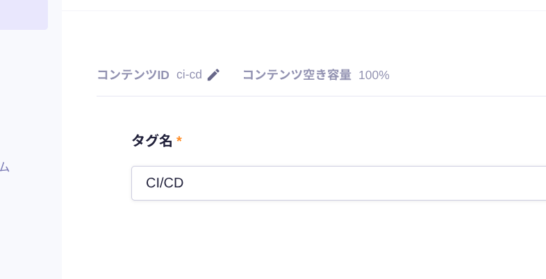

こんにちは。サムネは実家猫です。

本ブログで動的な変更がありうるタグや自己紹介、職歴などは、microCMS上で管理しています。
ただ、諸般の事情で記事のみマークダウン（MDX）管理となっています。

記事のタグづけはマークダウンのFrontmatterへの記載によりますが、マスターデータはmicroCMS上にあるので、なんらか紐付ける必要あり。

この紐付けをAstroの`reference()`で行い、Content Collectionレイヤーで担保するお話です。

## Astroのreference()

`astro:content`のドキュメントに記載があります。

https://docs.astro.build/en/reference/modules/astro-content/#reference

使い方は非常に簡単で、`defineCollection()`する際のZodでの型定義で利用します。公式のサンプルコードをそのまま引用。

```typescript
import { defineCollection, reference, z } from 'astro:content';
import { glob, file } from 'astro/loaders';

const blog = defineCollection({
  loader: glob({ pattern: '**/*.md', base: './src/data/blog' }),
  schema: z.object({
    // Reference a single author from the `authors` collection by `id`
    author: reference('authors'),
    // Reference an array of related posts from the `blog` collection by `slug`
    relatedPosts: z.array(reference('blog')),
  })
});

const authors = defineCollection({
  loader: file("src/data/authors.json"),
  schema: z.object({ /* ... */ })
});

export const collections = { blog, authors };
```

上記のサンプルコードでは、`blog`コレクションから`authors`コレクションへの参照が定義されています。
よって、`authors`に存在する値しか`blog`では利用できないという状態になります。

また、`blog`コレクションへの自己参照が定義されているのもわかります。`z.array`の中で呼び出すことで複数参照も表現できます。

コレクション同士を簡単に紐付けられるので、たいへん便利そう。

## microCMS上のデータをマークダウンに紐付ける

今回はマークダウン→microCMSの参照に、この`reference()`を使います。

### microCMS上のデータ

microCMS上のデータは以下のスクショのようになっています。



* コンテンツID: タグのslug
  * タグを含む記事一覧ページのslugに利用します
  * コンテンツIDはデフォルトでslugに利用しやすい文字列しか入力できないので、microCMSに文字列バリデーションの役割を持たせています
  * デフォルトで文字列の重複チェックもしてくれるので都合がいいです
* タグ名: タグの表示名

### Astro上の定義

Astro上の`content.config.ts`で、タグと記事のコレクションを定義し、記事からタグへ`reference()`を用いた参照を定義します。

```typescript content.config.ts
const microcmsLoader = (endpoint: string) => {
  // microCMSからデータを取得する処理
};

const tagCollection = defineCollection({
  loader: microcmsLoader("tags"),
  schema: z.object({
    id: z.string(), // [!code highlight]
    name: z.string(),
  }),
});

const blogCollection = defineCollection({
  loader: glob({ pattern: "**/*.{md,mdx}", base: "./src/data/blog" }),
  schema: ({ image }) => z.object({
    title: z.string(),
    description: z.string(),
    pubDate: z.date(),
    tags: z.array(reference("tag")), 
    heroImage: image().optional(),
  }),
});

export const collections = <const>{
  blog: blogCollection,
  tag: tagCollection
};
```

ここで、`tagCollection`の`id`をハイライトしています。

Astroのコレクションは内部的に`content`と`data`タイプに分類されており、マークダウンとかは`content`に、JSONなどは`data`タイプとなります。
で、`reference()`を使った際に参照するキーは、タイプごとに異なります。
* `content`タイプ: `slug`
* `data`タイプ: `id`

Astroのこのへんで分岐が実装されています。

https://github.com/withastro/astro/blob/main/packages/astro/src/content/runtime.ts#L872-L939

今回、タグはmicroCMS上で管理しており、レスポンスはJSONなので、コレクションタイプは`data`になります。
`data`タイプのコレクションで使われる参照キーとして、`tagCollection`のschemaに`id`を明示的に定義しているわけです。

といっても、定義の有無にかかわらずレスポンスに`id`は含まれるので、今回のケースでは定義しなくても動きはするんですけどね。
もしレスポンスに`id`が含まれないデータを参照する場合は注意が必要です。

## 実装での取り回し

現時点のAstroの仕様では、参照元に参照先のデータは入らず、`id`や`slug`の配列が格納されるだけとなっています。

今回のケースでは、まず`blog`コレクションからデータを取得して、そこから参照されているタグを`tag`コレクションから取得する、という流れを踏まないと、データ全体は揃いません。

参照元の記事データにはタグの`id`の配列が入ってくるので、`getEntries()`を使って参照先コレクションを簡単に取得できる状態にはなっています。

```typescript
const { entry } = Astro.props;
const { title, pubDate, tags } = entry.data;

const tagEntries = await getEntries(tags);
```

microCMSのスキーマ定義のとおり、`tag`コレクションは`id`と`name`を持っているので、タグのコンポーネントなどに`tag`コレクションをまるごと渡せば、リンクと表示テキストを扱うことができます。

## マークダウンのFrontmatterでタグを指定する

記事を書く際は、マークダウン上のFrontmatterで`id`に相当する文字列、今回で言うとmicroCMS上のコンテンツIDを指定します。

```
---
title: "Astroのreference()を使ってマークダウンと外部データを紐付ける"
description: "Astroのreference()を使って、マークダウンとmicroCMSのデータを関連付けます。"
pubDate: 2026-01-12
tags: ["frontend"]
```

microCMS上に存在しないタグを指定した場合は、ビルド時にエラーになります。

## まとめ

改めてAstroのContent Layer APIを使ってみて、コンテンツを主としたウェブサイトでは非常に強力な機能だなと感じました。

上沼恵美子さんもフアンになったと言っています。たぶん。