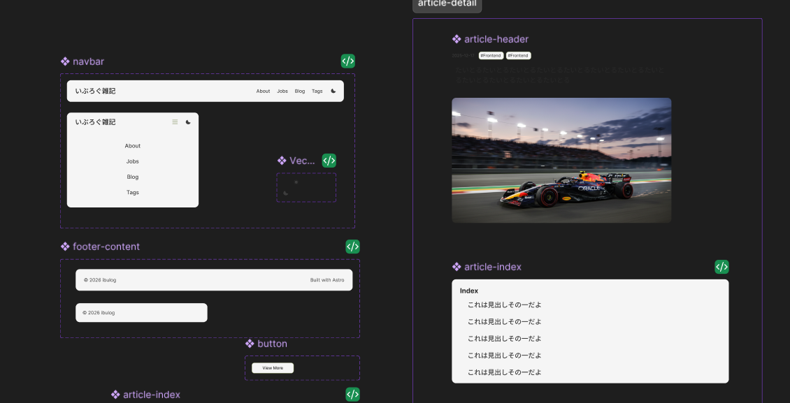
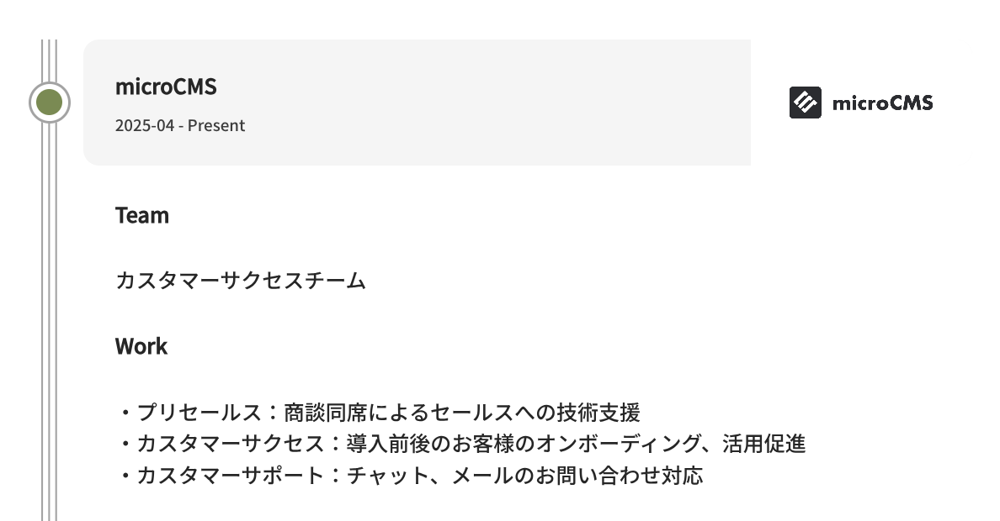
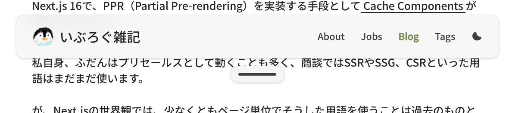
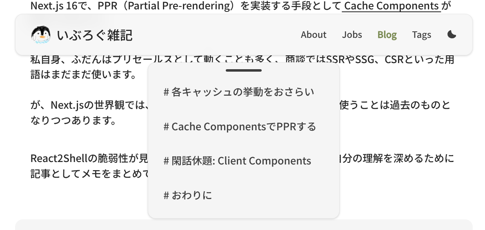
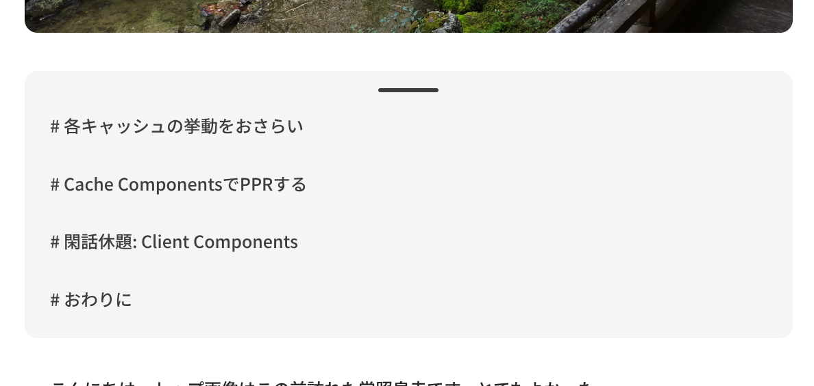

あけましておめでとうございます。2026年もどうぞよろしくお願いいたします。
サムネイルはうっすら雪化粧した洩矢神社です。

明けて早々昨年末の話で恐縮ですが、割と適当に作っていた本ブログをリニューアルしました。
内容は変わっていませんが、デザイン面を大きく変更し、内部の構成にも少し手を入れました。

## リニューアル後の構成

以下がリニューアル後の構成です。

* フレームワーク: Astro（全ページSSG）
* 言語: TypeScript
* 状態管理: Alpine.js
* スタイリング: Tailwind
* コンテンツ管理: MDX、microCMS
* ホスティング: Cloudflare Pages

フレームワークやホスティング先は変えてません。
今回はあえてReactなどのUIフレームワークは使わず、素のAstroコンポーネントのみで実装しています。

最初は状態管理もVanilla JSでクラスを付け替えて...という感じで実装していましたが、一ヶ月後には実装の中身を忘れる自信があったのでAlpine.jsを導入しました。
Alpine.jsは初めて使いました。ちょっとした状態管理くらいなら手軽に使えていい感じです。令和のjQueryという雰囲気。

変更がありうるコンテンツは基本的にmicroCMSで管理していますが、以下の理由から記事本体のみMDX管理としています。

* 記事はGitHubで管理したい
* remarkのプラグインを使いたい
  * microCMSのリッチエディタを使うとHTMLが返ってくるのでremarkを使いにくい
* 複数のデータソースが混在する環境でのContent Layer APIの機能検証をしたい
* microCMSからのプレビュー用ルートを用意する必要がある

最後はAstroの弱点かもしれません。

SSGするときに使う`getStaticPaths`はビルド時のみ呼び出される関数なので、microCMSプレビュー用のSSRルートも別途作る必要があります。
ラッパーLayoutを用意して、コンポーネント自体は共通化してしまえば、そこまで手間なく実装できるとは思う。

Live Content CollectionがExperimental featuresとして控えていますが、これも現状はSSRでのみ効果を発揮する機能。

https://docs.astro.build/en/reference/experimental-flags/live-content-collections/

Next.jsだとDraft Modeがありますし、別ルート作るとしても共通化できる部分が多いはずなので、下書きプレビューの取り回しはNext.jsに軍配が上がるところかなぁと思います。

## リニューアルのプロセス

今回は以下のようにリニューアルを進めました。

1. Figmaでデザインを作り込む
2. Figma MCPでデザインから下書き的に実装をAIで生成する
3. 生成した実装を手直し・機能追加していく

### Figmaでデザインを作り込む

今回のリニューアルはFigmaの勉強も兼ねていたので、デザインはAIにお任せせず、すべて自分で作り込みました。

AIでデザインも一気に変更、というのも可能ではあるんですが、AIを使ってデザインすると、どうしても「生成AIっぽい」デザインにまとまってしまうんですよね。
今の自分には、AI生成でもデザイン細部にこだわりを宿せるほどのスキルがないのと、個人ブログというのは自分の世界観を反映したい場所なので、生成AIは使わなかった次第です。

京都在住ということで、石庭をうっすらモチーフにしたつもりです。（職歴ページとか、アクセントカラーが苔っぽいグリーンになっているところとか、わかりやすい...よね！？）

Figmaもがっつり触るのは初めてでしたが、Variableとか使ってそれっぽい動きを再現できると楽しいですね。

ちなみにこのフェーズでもけっこうAIを頼りました。どんなレイアウトが一般的か、とか、フォントサイズはどれくらいにすべきか、とか...。
デザイン上ブレさせたくないコンセプトは自分の中に持ちつつ、それを磨いていく壁打ち相手として、たいへんにお世話になりました。

### Figma MCPでデザインから下書き的に実装をAIで生成する

FigmaにはMCPサーバーがあるので、それを使ってAIと連携し、下書き的に実装してもらいます。

FigmaにはリモートMCPサーバーとデスクトップMCPサーバーの2種類があって、精度が高いのはデスクトップMPCサーバーのようですが、残念ながらLinux向けにはデスクトップアプリは未提供...。
ただ、Figma側のFrameやAuto Layoutなどが適切に組まれていれば、リモートMCPサーバーでもそこそこの精度で生成できました。

まずはFigma上のコンポーネントをAstroコンポーネントとして実装してもらって、それを利用してページ側を実装してもらう流れで進めました。

### 生成した実装を手直し・機能追加していく

出てきた実装そのままだと、表示が崩れている箇所などもあるので、これを地道に手直ししていきます。
実装を深める中でコンポーネントの抽象度を変えたいケースも出てくるので、そういうリファクタもやっていきました。

また当然ですが、Figmaから素直に書き出したコンポーネントには状態を管理する機能はないので、状態まわりの実装も粛々と行います。

こんな感じで、仕事前の空き時間などにちょこちょこ作業して、だいたい2週間くらいかかりました。
デザインの作り込みに半分以上費やしていると思います。

## こだわりポイント

個人的に「ここはうまくやったな」とか「ここは好き」というポイントもまとめておきます。

### 職歴ページのデザイン

ここはけっこう難産なページでした。石庭のモチーフはいれつつ、デザインをまとめるのが難しく...。

最終的には、記事ページでも使用しているリンクカードのデザインを流用しつつ、左側に石庭の線と石のイメージを配置する、という形に落ち着きました。

右側の画像はOGPから取得しています。

ちなみにこのデザインはFigmaで作り込んだものではなく、実装中に思い立ったものです。そういうこともある。

### 目次バー

記事詳細ページの目次のデザインとしては「サイドに配置」がよくあるパターンかな？と思っています。Zennとかそうなってますよね。

あれはあれでいいんですが、個人ブログの場合はそこまで見出しが多くならないので、目次下部のスペースがガラ空きになって有効活用できないのが悩みポイントでした。

そこで、目次はバーとして格納し、クリックで展開できるようにしました。

また、目次自体にも同様のバーを設置することで、「クリックすると目次が展開される」というメンタルモデル形成を狙っています。

## 宿題

とりあえず形にはなったので満足していますが、気になるところはちらほら残っています。

* 記事詳細から記事一覧に戻るときのアニメーションのちらつき
* タグ一覧ページが質素
* ほか細かい部分

このあたりはのんびり直していく...。

## まとめ

これほどしっかりしたプロセスを踏んで個人ブログを作ったのは今回が初めてでした。個人ブログとはいえ、こだわるとけっこう骨が折れますね。

とはいえ、2026年はアウトプットを増やして生きたいと思っているので、その場所を整えることができたのはいいことです。Figmaも理解が深まりました。

2026年もやっていくぞい！