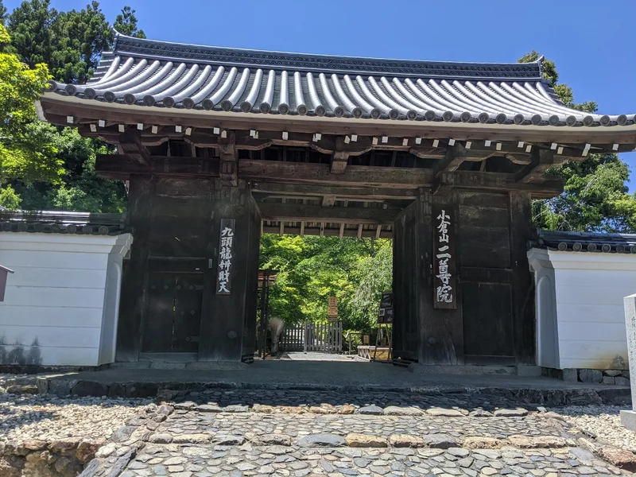
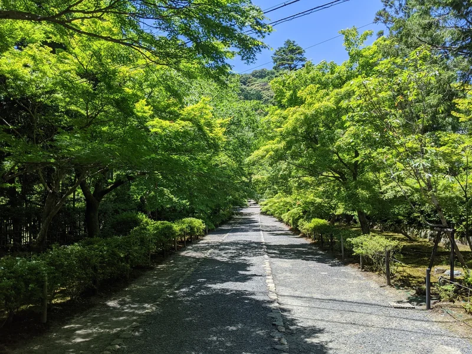
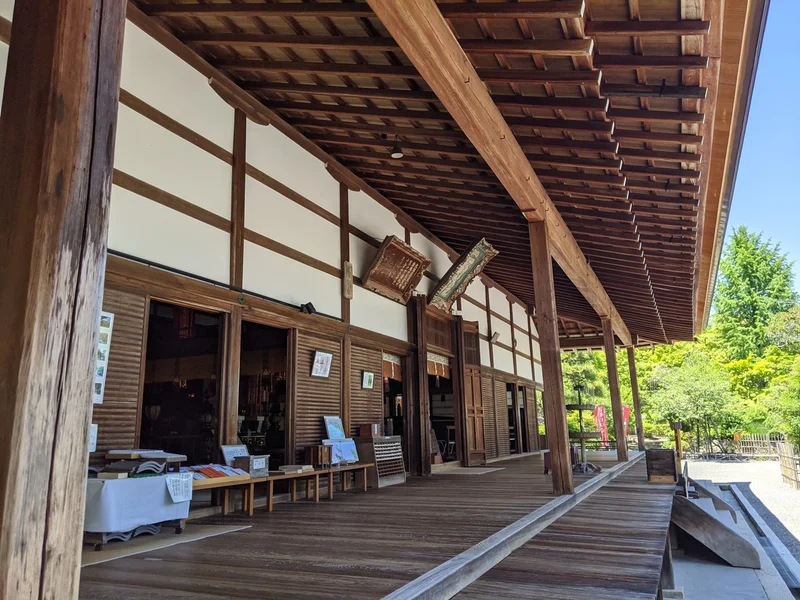
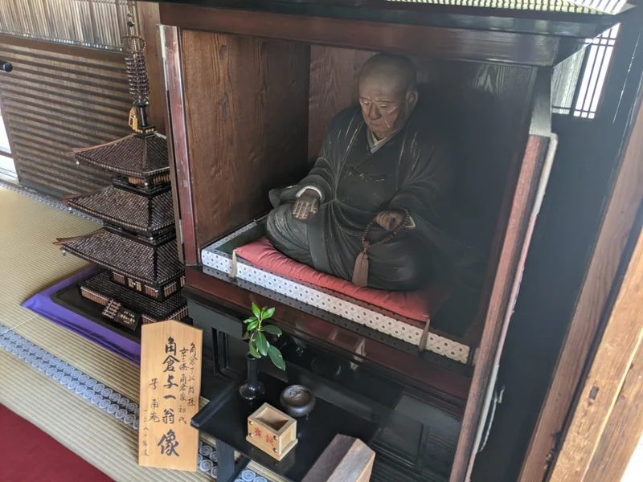
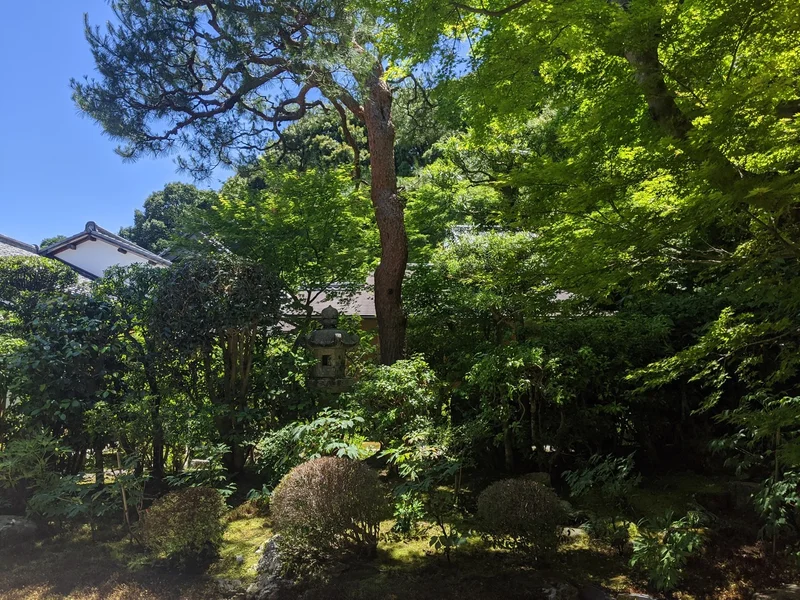
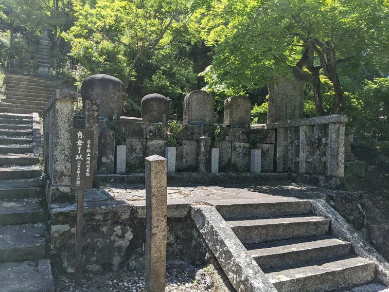
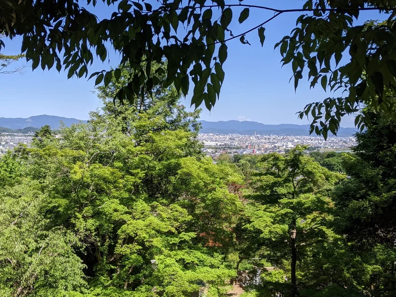
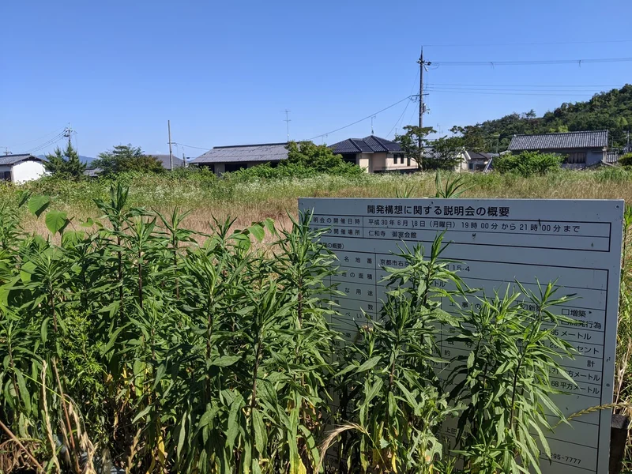
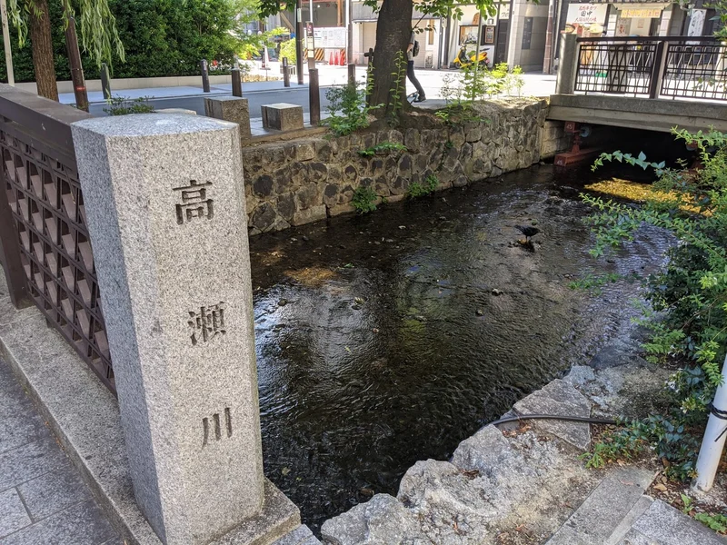
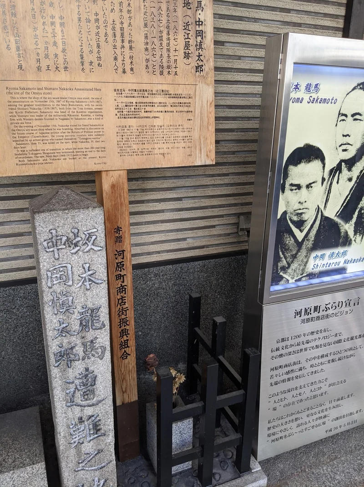

京都の嵐山と言えば「渡月橋」とか「天龍寺」とかを思い浮かべる方が多いと思います。駅チカで観光しやすいスポットですし、実際いいところですもんね。

そんなガイドブックのトップになるような観光スポットから20分ほど歩いたところに、私のおすすめスポット「二尊院」があります。二尊院もかなり有名ではあるんですが、嵐山の中心地からは少し外れているせいもあってか、けっこう穴場です。

めちゃくちゃいい天気だったのと外で読みたい本があったので、久しぶりに二尊院を訪れてみました。

## 阪急嵐山駅〜二尊院

まずは有名な渡月橋から桂川を望みます。平日＆コロナで人はほとんどいませんでした。もちろんマスク着用で密は避けてます。

お土産屋さんや飲食店などがある通りを抜けて左手に入ると、竹林です。

大抵の方は竹林を見ると満足して帰ってしまうのですが、ここからもうひと踏ん張りして西に15分ほど歩くと、二尊院にたどり着きます。

## 二尊院

二尊院は天台宗の寺院。門をくぐってすぐの「紅葉の馬場」と呼ばれる参道には、秋になると紅葉見たさに観光客が大勢押し寄せます。が、夏はほとんど人がいません。目が覚めるような新緑もきれいなんですけどね。管理人の方によると「雨上がりがきれい」らしいです。

本堂の写真を正面から撮るのを忘れてしまいましたが、横からはこんな感じ。これで雰囲気を掴んでください。

本堂内にはかつて京都商人として名をはせた「角倉家」初代の肖像が安置されています。二尊院は角倉家の菩提寺なんですよね。

こちらも全体像を撮影しそこねてしまいましたが、本堂の縁側は、ししおどしの音を聞きながら涼める最高の場所です。初めて京都に来たときからお気に入りスポット。拝観料がかかるので何度も訪れているわけではないですが...

縁側に座って本に目を落としていると、どこからか視線を感じました。あたりを見回してみると、どうやら先客がいたようです。毛並みが狸っぽいですが、目が猫っぽい。

こちらを凝視しながら山へ去っていきました。邪魔してすまんかった。

角倉家の菩提寺ということは、日本史にも出てくるあのお方の墓も当然二尊院にあるわけです。ステイホームでなまった体にむち打ちながら石段を登っていくと...

はい、江戸時代に京都でブイブイいわせた豪商、角倉了以の墓があります。角倉了以は私財で高瀬川などの水路を整備した、日本史の教科書にもよく出てくる歴史上の人物ですね。

日本史の問題ではよく河村瑞賢と混同して出題されます。受験生以外は覚えても何も得にはなりません。

- 角倉了以：京都の水路を整備
- 河村瑞賢：西回り航路を開拓

角倉了以の墓地がある場所からは、京都タワーや大文字山など、京都を一望できます。

二尊院から駅に戻る途中でこんな銅像を発見。幕末の土佐藩で活躍した志士である吉村寅太郎、武市瑞山(武市半平太)、坂本龍馬、中岡慎太郎像です。当時天龍寺に詰めていた来島又兵衛、久坂玄瑞を訪ねるためにここに立ち寄ったそう。

## 仁和寺

天気が良かったので、二尊院からさらに西へ、嵐山から嵯峨野エリアへと歩いてみました。

嵯峨野の寺院でなにかと注目されているのがここ、仁和寺です。僧侶の残業代未払問題など、いろいろニュースになるお寺。

最近は何が問題になっているかというと、仁和寺の真正面にある広大な空き地に高級ホテルが進出することが決まり、近隣住民から反対の声があがっているようです。過去にもコンビニやガソリンスタンドなどが同じ土地に進出を画策しましたが、ことごとく失敗。おそらくオリンピック・万博をターゲットにした進出だとは思いますが、コロナの影響でどうなることか。

ちなみに現状の開発状況はこんな感じ。何も進んでいません。

確かに周りは閑静な高級住宅街といった雰囲気で、住民の方が反対するのもわかります。

## おまけ

帰りの道中に河原町で道草を食ったときに撮影した写真。角倉了以が開削した高瀬川です。この周囲は夜になると客引きがあふれかえるちょっと怖い場所ですが、昼間は人気もまばらです。

ついでに三条河原町〜四条河原町にある坂本龍馬と中岡慎太郎頓死の地。私の記憶では肖像画なんかなかった気がするのですが...

そんなこんなで京都の嵐山に行ったらちょっと遠くまで歩いてみてください、というお話でした。