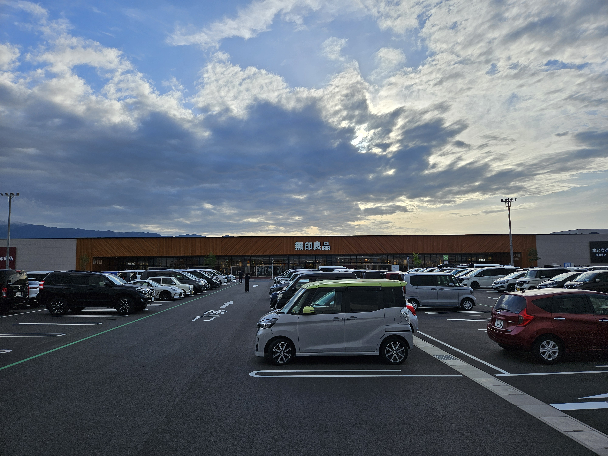
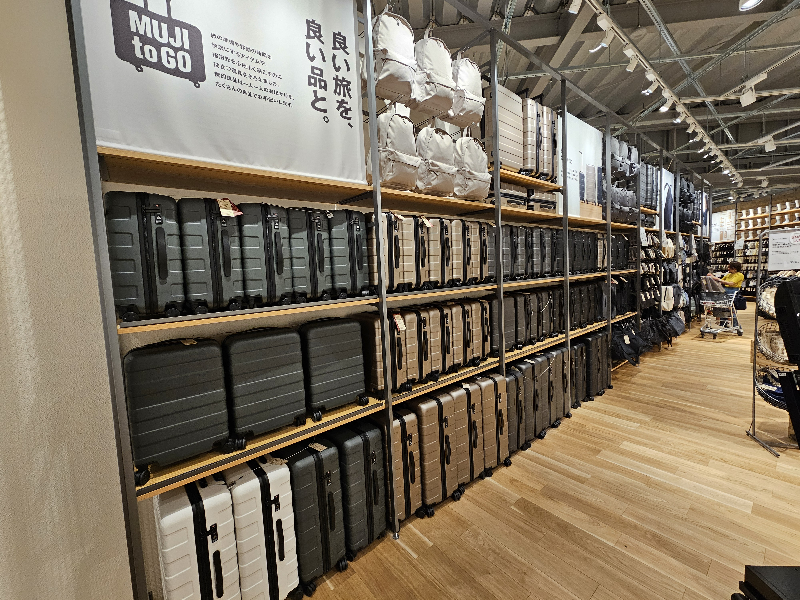
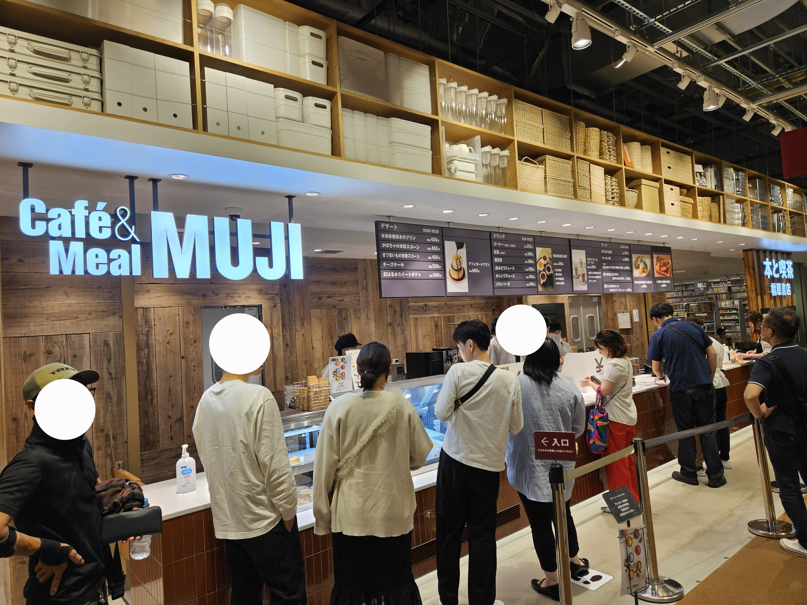

こんにちは。タイトルはかの[アイルトン・セナの名言](https://sportiva.shueisha.co.jp/clm/motorsports/motorsports/2018/10/01/___split_52/)から拝借しました。

今年3月に奈良県にオープンした世界最大の無印良品、ずっと行ってみたかったんですよね。

奈良の南の方にある京都からでも車で2時間以上かかる場所なので、ちょっと腰が重かったんですが、意を決して行ってみたら感銘を受けたのでブログを書いています。

## マジでデカイ

さて到着。

デカイ。マジで。

以前銀座の無印良品を訪れたときもデカイと思いましたが、その比じゃない。

しかも贅沢に1階店舗です。土地の暴力を感じます。

## 中に入る

中に入って少し進むと、なにやら温かみのある空間が現れます。

すごい。無印テーマパークだ。

品揃えは豊富もいいところで、衣服や文具、食材、家具家電はもちろんあります。

その種類もさることながら、量も規格外です。スーツケースをこんなに並べるスペースが、他の無印にあるでしょうか。

他にも書店や...

カフェまであります。

なんか健康チェックできるスペースまでありました。

とにかく無印のすべてがあります。かの海賊王が無印関係の財宝だけをそこに置いてきた感じです。

## 高揚感と不安

超絶広いワンフロアにすべてがあるこの無印、歩いてキョロキョロするだけでテンションが上がってきます。

が、しばらくすると、そこはかとない不安感も抱いている自分に気づきます。

あまりにも、周囲が無印すぎる。生活に必要なものすべてが、無印良品として用意されているわけです。

その強烈な世界観。

まるで今までの人生が無印良品によって再定義されていくかのような...いや、この世界というものが、もはや無印良品なのではないか...

そんな胡蝶の夢よろしく、現実と無印良品の境目がなくなっていくような感覚を覚え始めました。

## 佇む思想

そんなフワフワとした感覚でさまよっていると、食材などが陳列されているエリアとは逆の、「世界の片隅」にたどり着きます。

ここで私は、この無印良品の本質に気が付きます。

これ、なんだかわかりますか？

学校で使われていた机と椅子です。

こちらは古着を回収するエリア。

写真を撮りそびれましたが、回収した古着を藍染めしたものが、商品として陳列されていました。

この風景を見て、私は思いました。

ここは単なるクソデカ無印ではなく、無印良品というブランドの、いや、もはや思想の、その粋を集めた、ひとつの「世界」なのだと。

人々はここで子を生み、育て、そして、死んでいくのだと。

## 奈良という場所

そんなことを考えていると、この場所が奈良は橿原であるということに思い至ります。

振り向けば、三輪山麗にましますは大神神社。

大神神社といえば、日本最古の神社として有名。2本の柱を縄で渡した古式の鳥居が見られる、山そのものを御神体とした素朴な神社です。

そして、無印良品もまた、シンプル・素朴・自然への回帰がテーマ。

現代の新古典主義とも言えるような無印良品が、いにしえの地に世界を築く。

そんな奈良という地に、神秘性を感じざるをえません。

私は食材コーナーに戻り、カゴにレトルトカレーを山ほどかきこむのでした。

## 無印好きは、一度はどうぞ

というわけで、最後はやりすぎ都市伝説風のまとめにトライしましたが、世界最大の無印良品、とてもよかったです。

隣接するイオンもクソデカで、スーパー銭湯もほど近くにあるので、次はまる一日あのエリアで過ごしてみたいですね。
