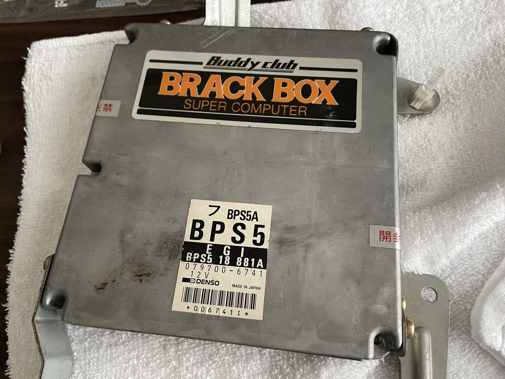
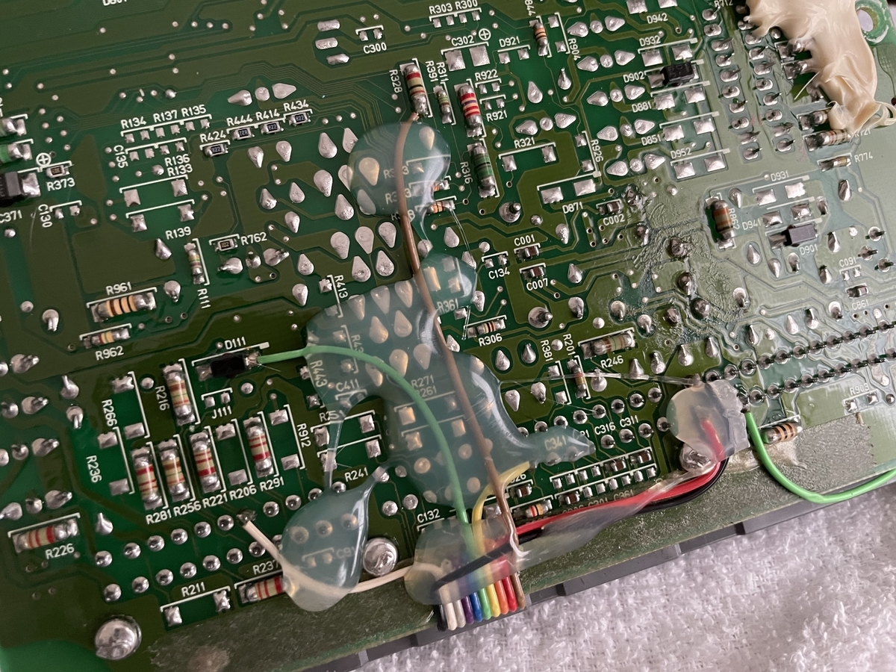

中古で買ったNA8Cですが、いろんなところが魔改造されていることが判明しています。

今回は最近発覚した魔改造のひとつ「ECU」のお話です。

## なんとなくECUをチェックしたら...

助手席で内装をいじっていると、足元が妙にふかふかすることに気づきました。

本来ECUの上には鉄板のカバーがついているのですが、それがないみたい。

カーペットをガッとはがしてみると...

<b>ん？？？？なにこれ？？？？？</b>

明らかに純正品ではなさそうなシロモノが出てきました。

### 魔改造その①：ハーネス類がSr2のものになっている

百歩譲って純正品でないECUがついているのは理解できます。

ただ、ECUの型番が「**Sr2**」用の「**BPS5**」というのは、どういうことでしょう...？

うちのNA8Cちゃんは車体番号30番台の「**Sr1.5**」なので、ECUは「**BPF3**」がついているはずなんですが...？

BPF3とBPS5はカプラー形状が異なり、互換性がありません。

つまり、うちにNA8Cちゃんのハーネスが「Sr2」のものに取り替えられているようです。

道理でフットライトの配線がないわけだ...Sr2からはピラー部にライトが移動しましたからね。

なぜそんなことをしたのか、理由はよくわかりませんが、状況は把握しました。

### 魔改造その②：よくわからないチューンドECU

ハーネスがSr2化されているのはいいとして。

Sr2のECUは16bit化されてチューニングできないと聞いたことがあるのですが、目の前にチューンドECUらしきものが存在しています。

公道で使ったらいかんシロモノらしいので、痛い出費ですが純正ECUを買うことが決まってしまいました。にしてもかなり古いですね。

実はこの時点で、かなりいやーな予感がしていました。某Fire氏のブログを見たことがある方は、察しがつくのではないでしょうか。

ケースを開けて中身を確認。うん、いわずもがな、怪しい基板が追加されています。

基板裏側も見てみましょう。なんかよくわからない場所をバイパスしているように見えます。

以下のページに回路図があったので確認。どうやらセンサー類の信号をバイパスしている模様。

http://do-da.co.jp/wiring_diagram/index.html

某Fire氏の情報そのまま、という感じですね。

### もやもや...

結局ECUはヤフオクで中古美品を落札し、そっちに交換しました。

にしてもなんでハーネスのSr2化なんか、元オーナーさんはやったのだろう。

そしてECUのほうは、多くは語るまい。

おわり。