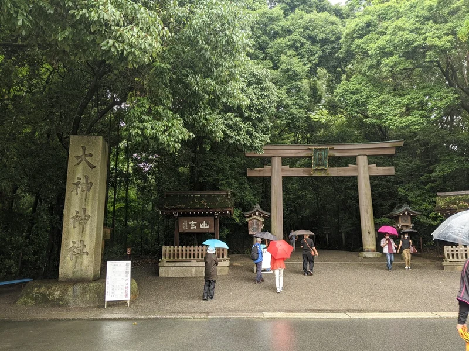
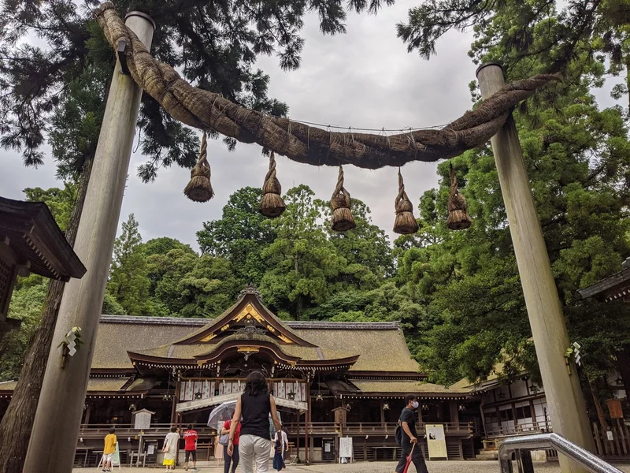
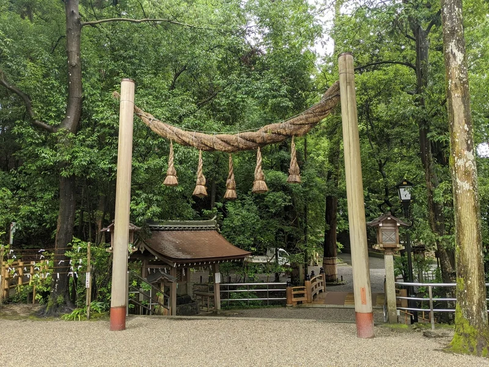
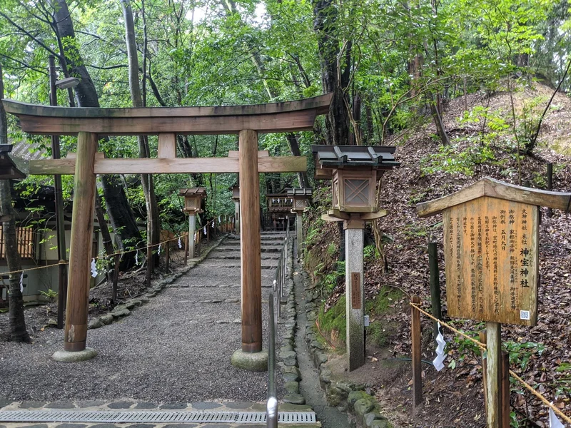
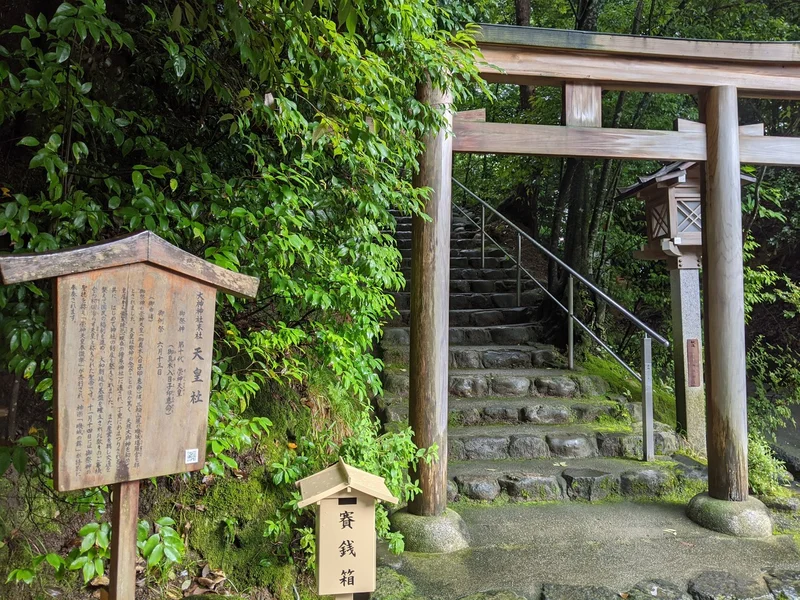
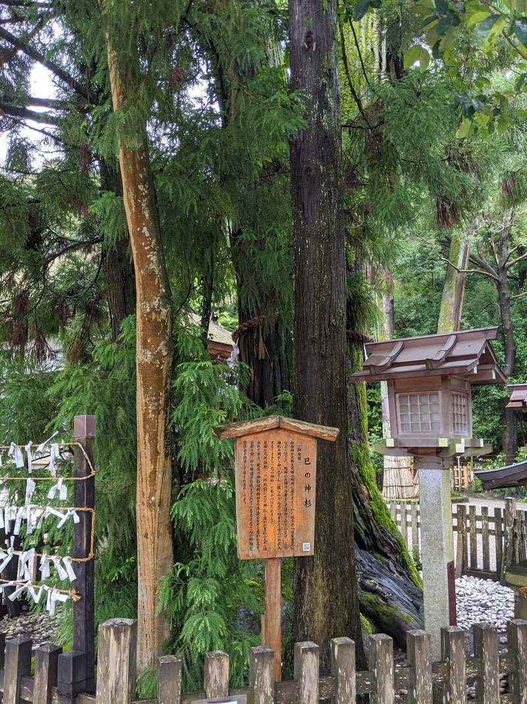
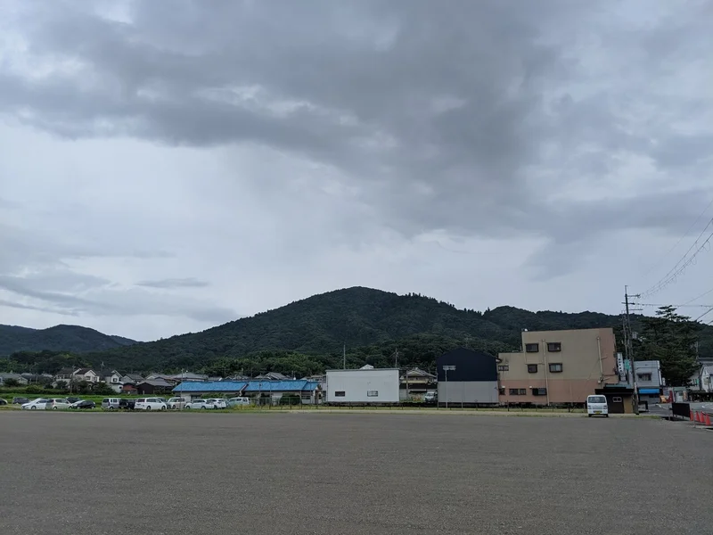
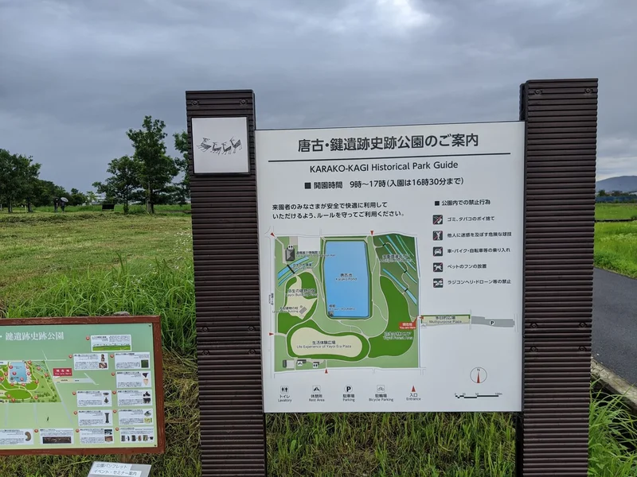

こんにちは、いぶろぐです。

コロナで行動が制限されるご時世ですが、「密にならない」「マスク必着」「公共交通機関は使わない」という条件を設けつつ、大神神社に参拝してきました。

やっぱり大神神社はよい。

## 入り口

というわけで車で移動し到着。森の静寂がたまりません。

森をくぐり抜け境内へと入っていきます。当日は雨が降っており、森の静けさがいっそう引き立っていました。

## 古式な鳥居

大神神社といえばこれ。「柱2本にしめ縄渡しスタイル」の古式な鳥居です。

境内入って右手にも同じスタイルの鳥居があります。

と言ってもすべての鳥居がこのスタイルなのかというとそうではなく、末社の神宝神社や...

天皇社の鳥居は普通のスタイルです。

## 崇神天皇を祀る天皇社

天皇社は第十代天皇である崇神天皇を祀っています。崇神天皇は実在した可能性のある最初の天皇として知られていますね。

鳥居をくぐって階段をのぼると、天皇社があります。

## いざ拝殿へ

天皇社からささっと階段を下って、大神神社拝殿を拝みます。大神神社は諏訪大社上社本宮などと同じで、本殿がなく拝殿のみの神社。つまり、ご神体は拝殿の向こう側にある自然そのものということになります。大神神社の御神体は、拝殿の向こうにある「三輪山」です。

りっぱな拝殿ですね。1664年に徳川家綱によって再建されたそう。

こちらは拝殿近くにある「巳の神杉」と呼ばれるご神木。大神神社で祀られている大物主大神は「巳（蛇）」の姿をしていたそうで、古事記や日本書紀では三輪山に鎮まることを望んだとされています。

その昔、この杉の木から白い蛇が姿を現したそうで、「大物主大神の化身」として扱われていたとか。だから「巳の神杉」なんですね〜。

最後に三輪山の全景を。御神体となる山のことを「神奈備」といいますが、意外と神奈備とされている山って「普通」なことが多い気がします。

## おまけ：唐古・鍵遺跡

せっかく奈良まで足を運んだので、ついでに代表的な環濠集落である「唐古・鍵遺跡」にもお邪魔してきました。

唐古・鍵遺跡といえばなんといってもこれ！「土器に描かれた絵をそのまま再現したために、よくわからないマキマキがついている楼閣」です。

賛否両論ありますが、自分はけっこう好き。