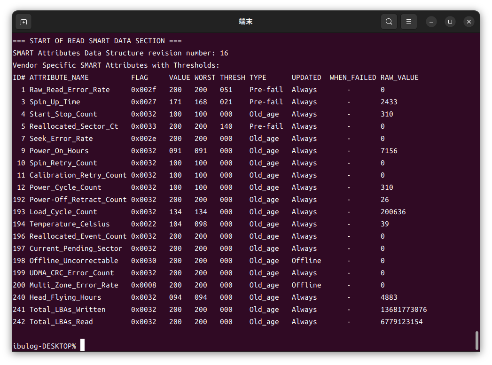

今年はなんでもいいからアウトプットしていこうと思い、久々にブログを動かしてみました。

本日は、自作PCに積んでいる古いHDDを交換するお話です。

RAID-Zを組んでいるのでちょっと手順がややこしく、メモしておこうかと。

### 追記

本当は`/dev/sdc`ではなく、`/dev/sdc1`を指定したほうがよかったっぽいので、あとでやり直したのは内緒です。

## 10年もののHDDが壊れそう

これが10年くらい使っているSeagate製HDDのS.M.A.R.T値です。


`CurrentPendingSector`（代替処理が保留されている不良セクタ数）と`Offline_Uncorrectable`（回復不能なセクタ数）はゼロですが、`RawReadErrorRate`（データ読み込みのエラー率）や`SeekError_Rate`（シークのエラー率）はけっこうヤバそう。

対してこちらが2年ほど使っているWDのHDDのS.M.A.R.T値。健康です。



RAID-Zなので片方のHDDが壊れても無問題ですが、予防整備として交換しておきます。

## 交換手順


### 1. 交換するHDDをオフラインにする

`zpool status`で現状を確認します。


 
ディスクはどちらもオンラインなので、壊れてはないっぽい？

ただし、古い方のHDDは正しく書き込みできていない可能性は大いにありますね。RAID-Zなので、どっちかが壊れていてもわかりませんし。

今回交換するのは`sdc1`の方です。

下記のコマンドを実行して、交換するディスクをオフラインにします。

```shell
sudo zpool offline upool sdc1
```

### 2. HDDを交換する

物理的にHDDを交換します。

左が古いSeagate製HDD、右が新しい東芝製HDDです。


SeagateのHDDは、確か2012年モデルのiMacに内蔵されていたものだった気がします。

10年間お疲れ様でした。

### 3. 新しいHDDをRAID-Zに追加する

下記コマンドを実行し、zpool内のHDDをリプレイス。あとは同期が完了するのを待つだけです。

```shell
sudo zpool replace upool sdc1 /dev/sdc
```


## まとめ 

めったにやらない作業なので、備忘録としてまとめておきました。

これでしばらくデータが消える心配をしなくてよさそうです。