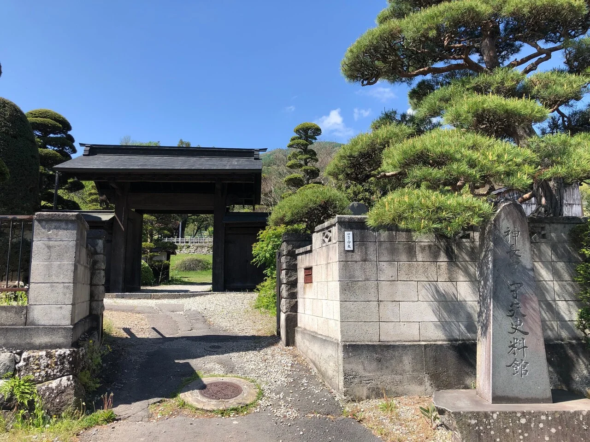
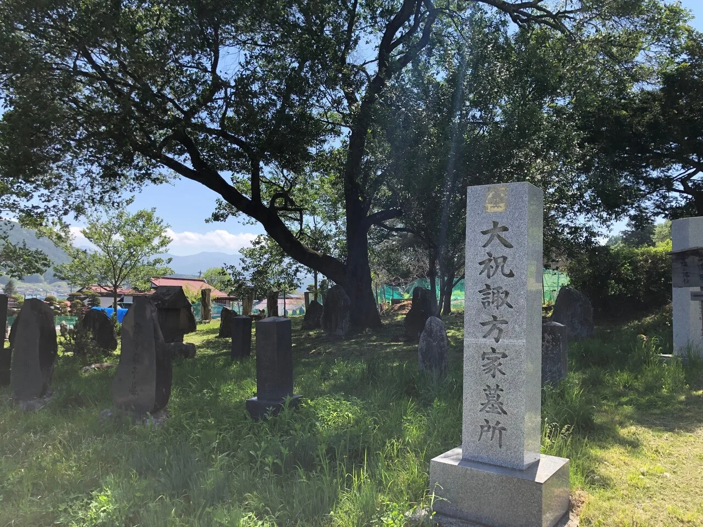
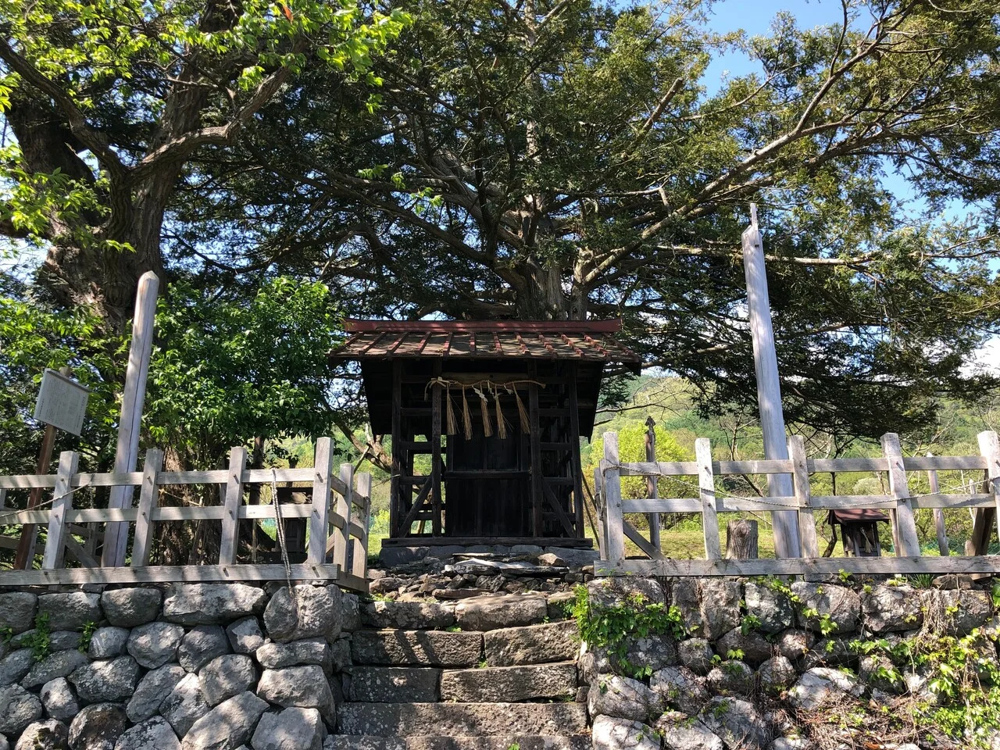
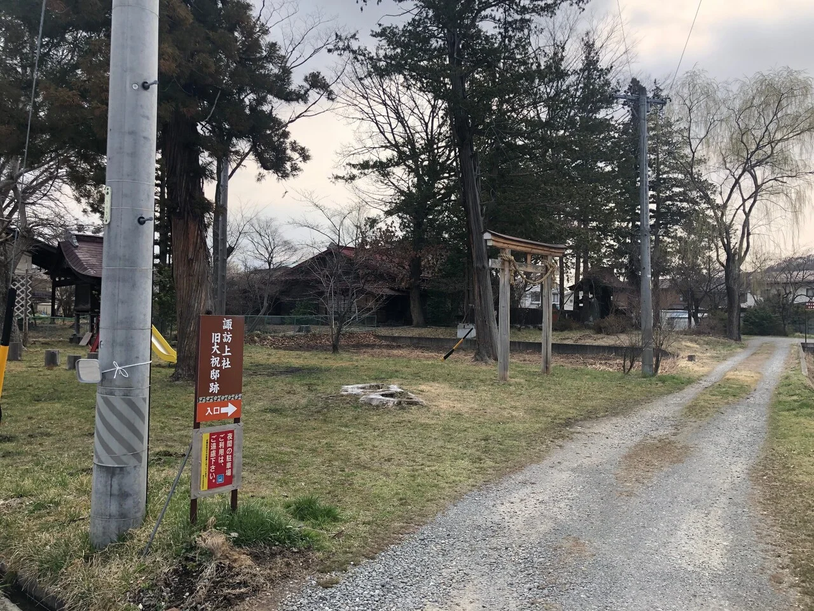
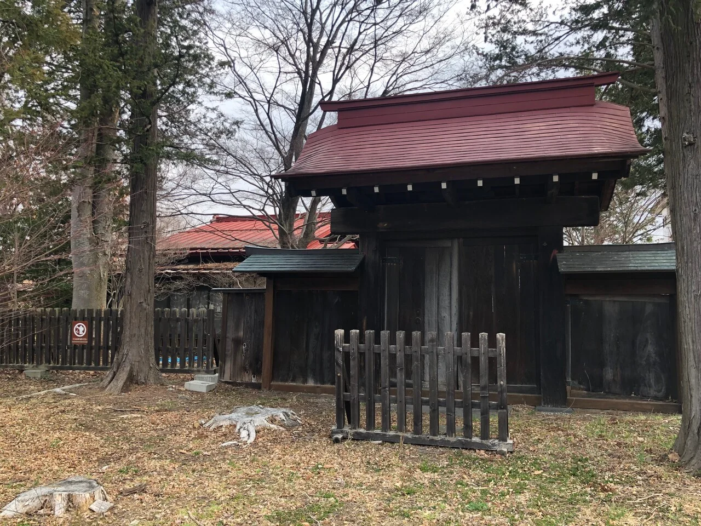

「諏訪が好き」後編です。

前編はこちら。

[諏訪が好き ミシャグジさまの 諏訪が好き（前編）](../20200628-suwa-1)

## 神長官守矢資料館

古くから諏訪の祭祀を取りまとめてきた「神長官」は、「守矢」一族によって代々受け継がれてきました。

神長官は後ほど紹介する「大祝」の即位を取り仕切ったり、ミシャグジさまを呼び寄せたりしていた、諏訪においてとても重要な役職です。

神長官守矢一族は現代まで続いており、今は守矢早苗氏が第78代当主を務めています。

そんな神長官・守矢氏の邸宅跡地にあるのが、諏訪信仰に関する資料を保管している「神長官守矢資料館」です。

この資料館は早苗氏が茅野市に寄託した資料などを保管しており、入館料を払えば誰でも入ることができます。

誰でも...と言いましたが、グロテスクなものが苦手な人は、遠慮して方がいいかもしれません。というのも、鹿の生首の剥製やうさぎの串刺しなど、かなり衝撃的なものが展示されているからです。

他にも「肉と脳みそを和えたもの」のサンプルなど、なかなかお目にかかれない代物が展示されているので、軽い気持ちで立ち寄る場所ではないかも。

しかし、諏訪信仰において、こうした動物は神様への供物であり、とても重要な存在であったのも事実です。

「血」の色が濃い資料から、諏訪信仰が縄文の影響を色濃く残していることが垣間見えますね。

ちなみに、先ほどの鹿は「耳裂け鹿」と呼ばれる鹿で、祭祀用に捕獲する75頭の鹿の中に、必ず1頭は耳が裂けた鹿がいたそうです。これは諏訪七不思議のひとつなんだって。

## 現人神「大祝」

「大祝」と書いて「おおほうり」と読みます。

大祝は諏訪信仰の象徴で、神長官によって秘法を授けられた「現人神」です。

大祝は代々「諏方氏」がその役目を受け継いできましたが、大祝という役職は明治時代に撤廃され、2002年には諏方氏そのものが途絶えてしまいました。

「ひぐらしのなく頃に」というアニメを知っている人なら、大祝は「オヤシロさま」の生まれ変わりである「古手梨花」みたいな存在、と言えば、わかりやすいですかね？

大祝と神長官は「信仰の対象」と「信仰の維持・運用係」という関係でしたが、両者は常に仲良しというわけではなかったみたいです。

先ほどの神長官守矢資料館から諏訪湖を背に少し登ったところに、諏方氏のお墓があります。

実際に現地に行くとわかりますが、大祝が小高い山麗から今も諏訪を見守っている、という気持ちになります。

## 大祝とミシャグジ

さて、そんな諏方氏のお墓からほど近いところには「ミシャグジ社」なるものがあります。

前編でミシャグジさまについては軽く触れましたが、ミシャグジさまは、簡単に言うと「諏訪地方で古くから信仰されている精霊的な存在」です。

このミシャグジを唯一取り扱うことができたとされるのが、神長官でした。

神長官はミシャグジをいろんなところに取り付かせ、ことが済んだら天に返す役割を担っていたのです。

一応、資料には「大祝にミシャグジを憑依させた」という記述は一切ないそうなのですが、個人的には神長官によってミシャグジを憑依させられた諏方氏が「大祝」になるものだ、と考えています。

## 大祝邸

で、この大祝・諏方氏の邸宅は、今でも残っています。観光客はほとんど足を運ばないような住宅地のど真ん中に、ひっそりと。

大祝は江戸時代以降、諏方氏の断絶に至るまで弱体化の一途でした。邸宅地も江戸〜明治あたりはもっと大きかったそうですが、今では最大時から半分以下の広さになっているみたいです。

大祝邸には誰もいません。自由に出入りしてOKです。

見学できるのは外観だけで建物の中には立ち入れませんが、当時からするとかなり立派な建物だと思います。

時代を感じる蔵もあり。

どんなに小さい社にも、しっかりと4本の柱が立てられている様子を見ると、諏訪信仰を守ろうとする氏子の方たちの意志の強さを感じます。

## 諏訪信仰の登場人物

前編と後編にかけて登場した、諏訪信仰にまつわる登場人物はこんな感じでした。

- タケミナカタ
- ミシャグジ（モレヤ神）
- 神長官
- 大祝

それぞれどういう関係なのか、というのはまさに研究が進められているところですが、おおよそは

土着神「ミシャグジ（モレヤ神）」と新しい神「タケミナカタ」が争い、タケミナカタが勝利。タケミナカタがモレヤ神を従える。モレヤ神を始祖とする「神長官」はタケミナカタの身代わりである「大祝」をサポートすることとなった。

ということみたいです。モレヤ神という新しいワードが出てきていますが、ミシャグジと同一視されることもあるので、ここでは同じ神様として扱います。

というわけで、ミシャグジさまをめぐる諏訪の旅はおわりです。また行きたい〜。

## おまけ

諏訪大社に行くと必ずチェックするのが、「T2O」という絵師さんの絵馬です。ゲーム「東方」のキャラクターの絵が描かれていて、かわいい！

ものすごいマメに絵馬奉納されていて、行くたびに新しい絵馬に出会えるので、密かな楽しみになっています。